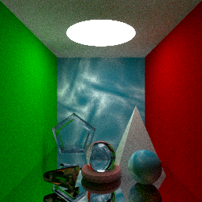
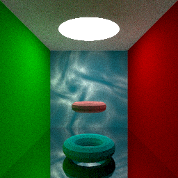
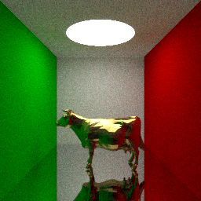

# 太极图形课S1-大作业 路径追踪渲染器

## 作业来源
这个项目是在太极图形课渲染示例代码上拓展完成的。主要实现了光线与多边形面片求交，圆环体生成，obj文件读写，渲染加速结构，和纹理贴图。

- 示例代码库: [*taichi_ray_tracing*](https://github.com/taichiCourse01/taichi_ray_tracing)。
- 光追加速结构参考了[Ray Tracing The Next Week](https://raytracing.github.io/)，
  和这个[计算图形学笔记](https://zhuanlan.zhihu.com/p/144403802)。
- 纹理生成参考了代码库[Shadertoys](https://github.com/taichiCourse01/--Shadertoys)。
- 球面纹理贴图参考了[Ray Tracing The Next Week](https://raytracing.github.io/)。

## 运行方式

#### 运行环境：
`[Taichi] version 0.8.3, llvm 10.0.0, commit 021af5d2, osx, python 3.6.3`

#### 运行：
在运行path_tracing.py时，可运用命令行参数 --test_number (1 或 2 或 3) 切换到设置的场景。
--max_depth, --samples_per_pixel, --samples_in_unit_sphere 均为示例代码path tracer的参数。用于设置光线追踪迭代次数，每个pixel采样光线条数，是否在单位球里进行均匀采样。

运行渲染场景1: python3 path_tracing.py --max_depth 5 --test_number 1

## 效果展示
渲染场景效果图（max_depth 设置为5)
|场景1 几何体集合 |场景2 两个圆环体 | 场景3 一只黄铜牛 |
|:-------------------------:|:-------------------------:|:-------------------------:|
| | | |

## 整体结构

```
-LICENSE
-|data
-|obj_files
-README.MD
-path_tracing.py
-ray_tracing_models.py
-mesh_models.py
```

## 实现细节：
1. 三角形和多边形类(Class Triangle, Class Polygon)：用于在场景中加入四棱锥或少量多边形面片
2. 平面类(Class Plane)：用于在场景中加入cornell box的面
3. 圆环体类和多边形类(Class Torus)：用于在场景中加入圆环体，并可将tesselation生成的圆环体写入obj文件
4. 网格类(Class Quad_Mesh, Class Triangle_Mesh):用于读入obj文件，并渲染多边形网格
5. 渲染加速：
    - 圆环体求交时，先与axis aligned bounding box求交。
    - 多边形网格物体求交时，使用2层BVH加速（假设从obj中读取的面，index相邻的，位置也相邻，按照index顺序划分组求小AABB，以得到较好的加速效果）
6. 贴图平面类(Class Plane_Textured)和更新后的球体类(Class Sphere)中可生成纹理以及纹理贴图
