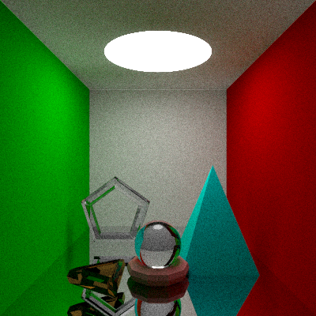

# 太极图形课S1-大作业

## 作业来源
这个项目是在太极图形课渲染示例代码上拓展完成的。主要实现了光线与多边形面片求交，圆环体生成，obj文件读写，以及渲染加速结构。
示例代码库: [*taichi_ray_tracing*](https://github.com/taichiCourse01/taichi_ray_tracing)。
光追加速结构参考了[Ray Tracing The Next Week](https://raytracing.github.io/)，
和这个[计算图形学笔记](https://zhuanlan.zhihu.com/p/144403802)。

## 运行方式

#### 运行环境：
`[Taichi] version 0.8.3, llvm 10.0.0, commit 021af5d2, osx, python 3.6.3`

#### 运行：
在运行path_tracing.py时，可运用命令行参数 --test_number (1 or 2) 切换到设置的场景。
--max_depth, --samples_per_pixel, --samples_in_unit_sphere 均为示例代码path tracer的参数。用于设置光线追踪迭代次数，每个pixel采样光线条数，是否在单位球里进行均匀采样。

运行渲染场景1: python3 path_tracing.py --max_depth 5 --test_number 1

## 效果展示
渲染场景效果图（max_depth 设置为5）


## 整体结构

```
-LICENSE
-|data
-README.MD
-path_tracing.py
-ray_tracing_models.py
```

## 实现细节：
1. 三角形类(Class Triangle)：用于在场景中加入四棱锥
2. 平面类(Class Plane)：用于在场景中加入cornell box的面
3. 圆环体类和多边形类(Class Torus, Class Polygon)：用于在场景中加入圆环体，并可将tesselation生成的圆环体写入obj文件
4. 网格类(Class Mesh):用于读入obj文件，并渲染多边形网格
5. 渲染加速：
    - 圆环体求交时，先与axis aligned bounding box求交。
    - TODO: 多边形网格物体求交时，使用均匀空间划分网格
6. TODO: 生成纹理以及纹理贴图
